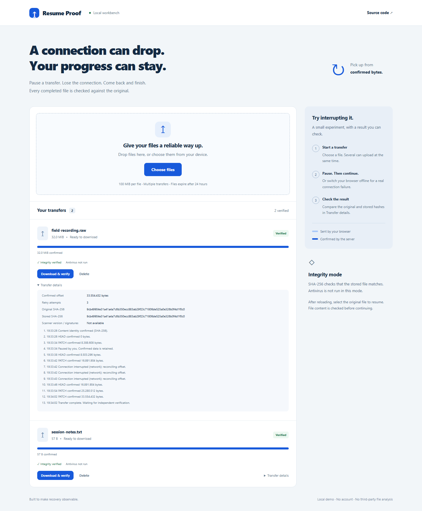
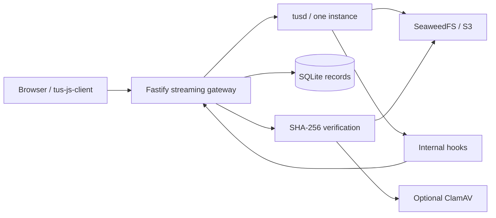

# Resume Proof

**Pause the upload. Lose the connection. Finish with the same bytes.**

A local transfer workbench demonstrating resumable uploads over tus, S3-compatible
storage, independent SHA-256 verification, and optional malware quarantine.
Multiple files can upload at once; each has its own pause and recovery state.

[](https://github.com/andresichelero/resistent-uploads-poc/actions/workflows/ci.yml)
[Demo video](https://github.com/andresichelero/resistent-uploads-poc/releases/tag/v1.0.0) ·
[Português](docs/README.pt-BR.md) · [Decisions](docs/decisions.md) · [Evidence](docs/evidence.md)



## Run locally

Requires Docker with Compose. The first run downloads images and dependencies.
Only the application port is published, on the loopback interface.

```sh
git clone https://github.com/andresichelero/resistent-uploads-poc.git
cd resistent-uploads-poc
docker compose up --build -d --wait
```

Open **http://localhost:3000**. Basic mode verifies integrity; it explicitly says
**Antivirus not run**. These are disposable demo files, retained for 24 hours
after their last upload activity.

For real malware scanning, allow roughly 4 GiB of RAM for ClamAV:

```sh
docker compose -f compose.yaml -f compose.antivirus.yaml --profile antivirus up -d --wait --wait-timeout 240
```

To return to basic mode, run `docker compose up -d --wait app`, then
`docker compose --profile antivirus stop clamav`. Existing adverse scan verdicts
remain blocked; changing modes does not relabel those files as clean.

Stop with `docker compose --profile antivirus down`. Named volumes retain state.
Delete demo uploads from the interface before removing volumes yourself.

## Try the failure

1. Select two files, up to **100 MiB each**. Throttle the browser network to make
   progress visible; local uploads can otherwise finish almost immediately.
2. Pause one upload and resume it. Then switch DevTools Network to **Offline**
   during an active transfer. This is a real transport failure, unlike Pause.
3. Restore the network. The client reconciles the remote offset before resending.
   After retries are exhausted, select **Resume**.
4. Reload during an unfinished transfer and select the original file again.
   Different content is rejected even when the filename and length match.
5. Open **Transfer details**. Compare original/stored SHA-256 digests; download
   and independently verify the returned bytes.

The light track shows bytes sent by the browser. The blue track shows bytes
confirmed by the server. An ETA estimates transfer time, not hash or scan time.

## What is implemented

- Concurrent uploads, pause/resume, bounded retries and server-authoritative offsets.
- Persistent SQLite records and S3 state; reconciliation after process restart.
- Incremental browser hashing in a worker and independent streaming server hashing.
- Download progress, transfer estimates and browser-side download verification.
- Optional real ClamAV: clean, detected, inconclusive and unavailable are separate.
- Private storage, gated downloads, idempotent deletion and 24-hour cleanup.
- Real failure tests: lost response, offline browser, restart and conflicting writes.



## Verify it

With Node.js 24+ and the basic Docker stack running:

```sh
npm ci
npm run check
npx playwright install chromium
npm run test:integration
npm run test:e2e
```

After starting the antivirus profile, run `npm run test:antivirus`.
Integration tests restart/stop this project's services; browser tests clear its
demo upload list. Use a disposable environment. CI exercises both profiles.
Machine-readable results go to `artifacts/`; browser traces are kept on failure.

## Deliberate limits

This is a **single-user localhost demonstration**, not a public file hosting
service. It has no accounts, distributed locks, malware sandbox or download
resumption. Browser downloads buffer at most the demo's 100 MiB file limit.
Closing the browser loses its file handle; reselection is intentional.

The checksum proves content equality, not trustworthiness. A clean antivirus
verdict means no detection with the recorded engine/signatures, not absolute safety.
AWS S3 is a documented configuration path, **not a verified deployment**.

The [design notes](docs/decisions.md) explain why tusd, a single instance, private
storage and final-content verification were chosen. [Research](docs/research.md)
credits the protocol, libraries, examples and public discussions that informed
the work. The protocol and scanner are reused; the application, failure harness
and presentation are the project contribution. MIT licensed.
